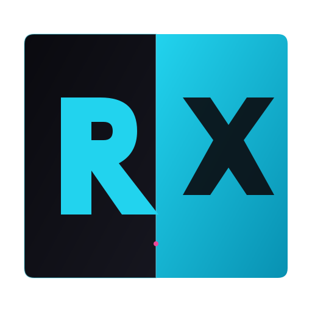

<div align="center">



# RobloxXea

**Advanced PWA toolkit for Roblox scripters.**

Browse verified tools, learn Luau, convert URLs to loadstrings, and contribute your own scripts — all in a dark, neon-themed progressive web app that works offline.

[](https://m7md0x.github.io/robloxxea/)
[](LICENSE)
[](https://github.com/M7mD0X/robloxxea-data/issues/new?template=submit-a-tool.yml&labels=submission)

</div>

---

## Features

- **Curated Tool Directory** — 12 official + 9 community tools with real, verified GitHub loadstrings
- **Auto-Verification** — a weekly GitHub Action re-fetches every loadstring URL and flags broken ones automatically
- **Tool Detail Pages** — each tool gets a dedicated page with executor-compatibility badges (auto-detected from source) and a GitHub releases changelog
- **URL to Loadstring** — paste a raw Lua URL, get a ready-to-paste `loadstring(game:HttpGet('...'))()` wrapper with GitHub blob → raw auto-conversion
- **Luau Docs** — 3 in-depth articles: Advanced Functions, Metatables & Hooking, Remote Spies
- **Favorites + Recently Copied** — star tools and see your copy history, persisted to localStorage
- **Issue-Driven Submissions** — community submits tools via a GitHub issue form; a bot auto-verifies the loadstring and opens a PR
- **PWA** — installable, offline-capable, auto-updating via service worker
- **Responsive** — collapsible sidebar drawer on mobile, fixed sidebar on desktop
- **Dark Theme** — deep black backgrounds with neon cyan/purple accents

## Tech Stack

| Layer | Technology |
|-------|-----------|
| Framework | React 18 + TypeScript |
| Build Tool | Vite 5 |
| Routing | React Router 6 |
| Styling | Tailwind CSS 3 |
| PWA | vite-plugin-pwa (Workbox) |
| Data | JSON feeds in a separate [data repo](https://github.com/M7mD0X/robloxxea-data) |
| CI/CD | GitHub Actions → GitHub Pages |
| Automation | Python scripts for loadstring verification + submission processing |

## Live Site

**https://m7md0x.github.io/robloxxea/**

## Getting Started

### Prerequisites

- [Node.js](https://nodejs.org/) 18+ (20 recommended)
- npm 9+ (comes with Node)
- [Git](https://git-scm.com/)

### Clone & Install

```bash
git clone https://github.com/M7mD0X/robloxxea.git
cd robloxxea
npm install
```

### Development

```bash
npm run dev
```

This starts Vite's dev server at `http://localhost:5173` with hot module replacement. The app uses the live data feed from the `robloxxea-data` repo by default, so you'll see real tools immediately.

### Production Build

```bash
npm run build      # Type-check + build to dist/
npm run preview    # Preview the production build locally
```

### Environment Variables (optional)

The app works out of the box with the default data feed. To point it at your own data fork, create a `.env` file:

```env
# .env
VITE_MAIN_TOOLS_URL=https://raw.githubusercontent.com/your-username/robloxxea-data/main/mainTools.json
VITE_COMMUNITY_TOOLS_URL=https://raw.githubusercontent.com/your-username/robloxxea-data/main/communityTools.json
```

See [`.env.example`](.env.example) for details.

## Project Structure

```
robloxxea/
├── public/
│   ├── rx-icon.svg              # Two-tone RX logo
│   ├── rx-icon.png              # PNG version for favicons
│   ├── 404.html                 # SPA redirect hack for GitHub Pages
│   └── ...
├── src/
│   ├── components/
│   │   ├── Nav.tsx              # Responsive sidebar (drawer on mobile, fixed on desktop)
│   │   ├── ToolCard.tsx         # Reusable tool card with clipboard + favorite
│   │   ├── CodeBlock.tsx        # Luau syntax highlighter + copy button
│   │   ├── InstallButton.tsx    # PWA install prompt
│   │   ├── UpdateToast.tsx      # Service worker update notification
│   │   └── ...
│   ├── pages/
│   │   ├── Main.tsx             # Home/overview with stats + featured
│   │   ├── ToolsPage.tsx        # Official + Community subtabs
│   │   ├── AppToolsPage.tsx     # URL to Loadstring
│   │   ├── Docs.tsx             # Luau articles
│   │   ├── ToolDetail.tsx       # Per-tool page with compat + changelog
│   │   └── UrlToLoadstring.tsx  # URL → loadstring converter
│   ├── hooks/
│   │   ├── useLocalStorage.ts   # Generic localStorage hook
│   │   └── useToolStorage.tsx   # Favorites + recently-copied context
│   ├── lib/
│   │   ├── compatibility.ts     # Executor API detection from Lua source
│   │   └── github.ts            # GitHub Releases API fetcher
│   └── data/                    # Bundled fallback data
├── .github/workflows/
│   └── deploy.yml               # Auto-deploy to GitHub Pages on push
├── CHANGELOG.md
└── README.md
```

## Contributing

Contributions are welcome! There are two ways to contribute:

### Adding a Tool (no code required)

1. Open the [**Submit a tool**](https://github.com/M7mD0X/robloxxea-data/issues/new?template=submit-a-tool.yml&labels=submission) issue form in the data repo.
2. Fill in the fields (name, author, repo URL, loadstring, category, description).
3. A bot will auto-verify the loadstring (HTTP fetch + Lua source check) and open a pull request.
4. A maintainer reviews and merges. The tool appears in the app within ~24 hours.

**All user submissions go to the Community tab.** The Official tab is maintainer-curated. See the [data repo's CONTRIBUTING guide](https://github.com/M7mD0X/robloxxea-data#adding-a-tool) for details.

### Code Contributions

1. **Fork** this repo.
2. **Create a branch**: `git checkout -b feat/my-feature`
3. **Make your changes** — follow the existing code style (TypeScript strict, Tailwind classes, functional components with hooks).
4. **Build to verify**: `npm run build`
5. **Commit**: `git commit -m 'feat: add my feature'` — follow [Conventional Commits](https://www.conventionalcommits.org/) (`feat:`, `fix:`, `docs:`, `chore:`, `refactor:`).
6. **Push**: `git push origin feat/my-feature`
7. **Open a Pull Request** against `main`. Describe what changed and why.

### Code Style

- **TypeScript strict mode** — no `any` unless absolutely necessary
- **Functional components** with hooks — no class components
- **Tailwind CSS** for styling — no separate CSS files except `index.css` for base styles
- **Conventional Commits** — `feat:`, `fix:`, `docs:`, `chore:`, `refactor:`
- **Responsive by default** — mobile-first, then `sm:`, `lg:` breakpoints

### Reporting Bugs

Open an issue with:
- What happened (expected vs actual behavior)
- Steps to reproduce
- Browser + device info
- Screenshots if applicable

## Architecture

```
┌─────────────────────────────┐         ┌──────────────────────────────┐
│  robloxxea (this repo)      │         │  robloxxea-data (data repo)  │
│  ─────────────────────────  │         │  ──────────────────────────  │
│  React app (Vite + TS)      │  fetch  │  mainTools.json (12 tools)   │
│  Deployed to GitHub Pages   │◄────────┤  communityTools.json (9)     │
│                             │         │                              │
│  Push to main →             │         │  verify_loadstrings.py       │
│  deploy.yml workflow builds │         │  Weekly cron (Mon 08:00 UTC) │
│  + deploys to Pages         │         │  → re-verifies every URL     │
│                             │         │  → opens issue if broken     │
│                             │         │                              │
│                             │         │  submit-tool.yml workflow    │
│                             │         │  → issue form → auto-PR      │
└─────────────────────────────┘         └──────────────────────────────┘
```

The app and data are **decoupled** — the app fetches JSON from the data repo at runtime, so adding tools doesn't require redeploying the app. The data repo auto-verifies every loadstring weekly and accepts community submissions via GitHub issues.

## Deployment

The app auto-deploys to GitHub Pages on every push to `main` via [`.github/workflows/deploy.yml`](.github/workflows/deploy.yml). The workflow:

1. Installs deps with `npm ci`
2. Builds with `GITHUB_ACTIONS=true` (sets the `/robloxxea/` base path)
3. Uploads `dist/` as a Pages artifact
4. Deploys via `actions/deploy-pages@v4`

No manual deploy step. Just push to `main` and the site updates in ~40 seconds.

## License

MIT — see [LICENSE](LICENSE).

## Acknowledgements

- All tool authors — every loadstring in the directory points to a real open-source Roblox script. See each tool's `repo` field for attribution.
- [Orion Store](https://github.com/RookieEnough/Orion-Store) — inspiration for the app/data split architecture and issue-driven submission workflow.
- [vite-plugin-pwa](https://vite-pwa-org.netlify.app/) — PWA support for Vite.
- [Tailwind CSS](https://tailwindcss.com/) — utility-first CSS framework.

## Related Repositories

- **[robloxxea-data](https://github.com/M7mD0X/robloxxea-data)** — the data feed (JSON + verification scripts + submission workflow). Fork this to customize the tool directory.

---

<div align="center">

Built with React, TypeScript, and Tailwind CSS.

[Report a bug](https://github.com/M7mD0X/robloxxea/issues) · [Request a feature](https://github.com/M7mD0X/robloxxea/issues) · [Submit a tool](https://github.com/M7mD0X/robloxxea-data/issues/new?template=submit-a-tool.yml&labels=submission)

</div>
